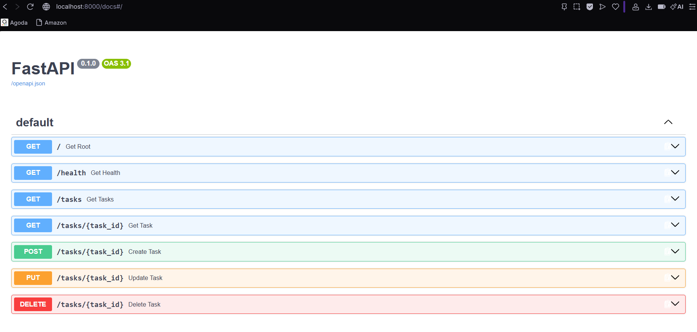
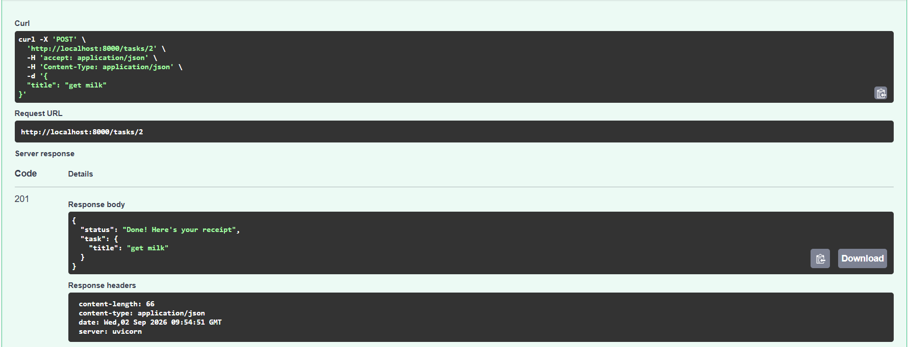
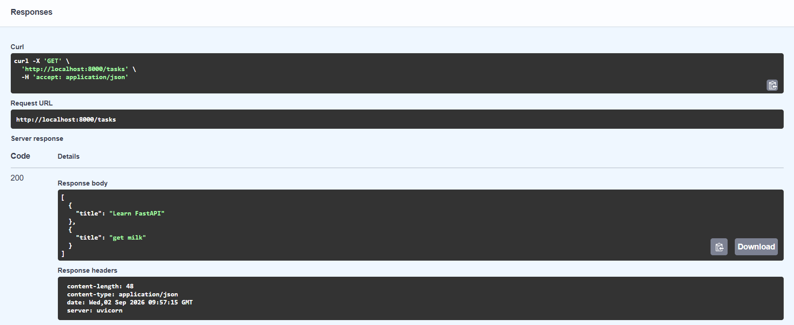
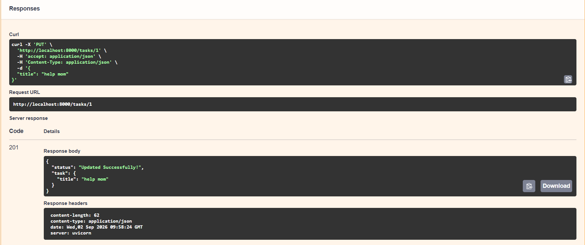
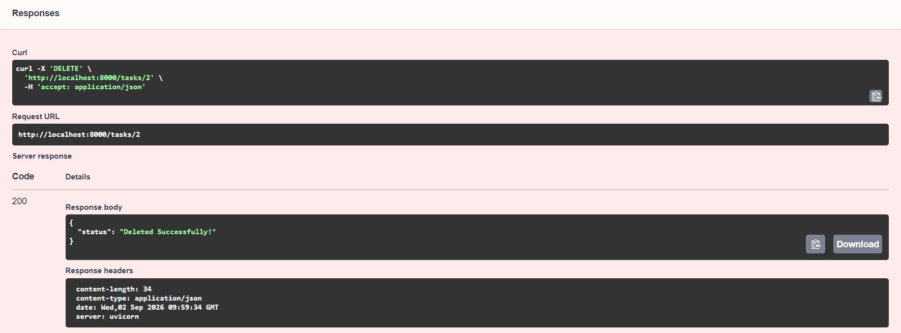
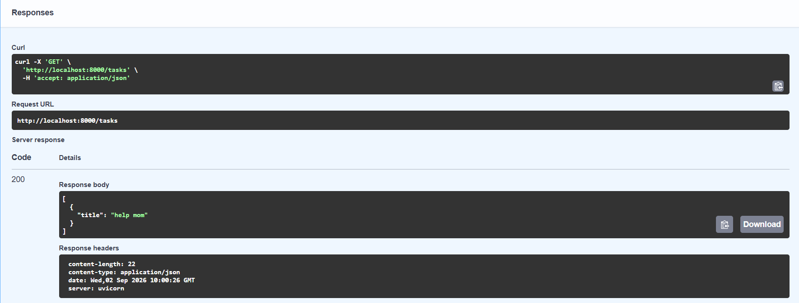

# Assignment-1-
FlyRank assignment

# Requirements
Python
FastAPI
Uvicorn

# Installation
1. Clone the Repository

git clone <your-repository-url>
cd my-project

2. Install uv

pip install uv

# Running the Application

uvicorn app.main:app --reload

uv run fastapi dev

The server will run at 
http:/localhost:8000

# Testing the Server
Open the following URL in a browser:

http:/localhost:8000/

The server should return the hello message

The endpoint can also be tested using curl:

curl -i http:/localhost:8000/

# Checkpoint
Fastapi server runs successfully on localhost:8000
GET / returns HTTP status code 200
The response contains the hello message

# Swagger UI

